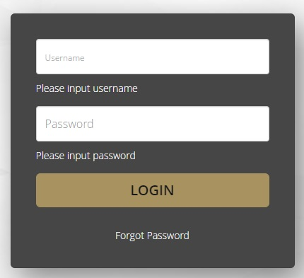
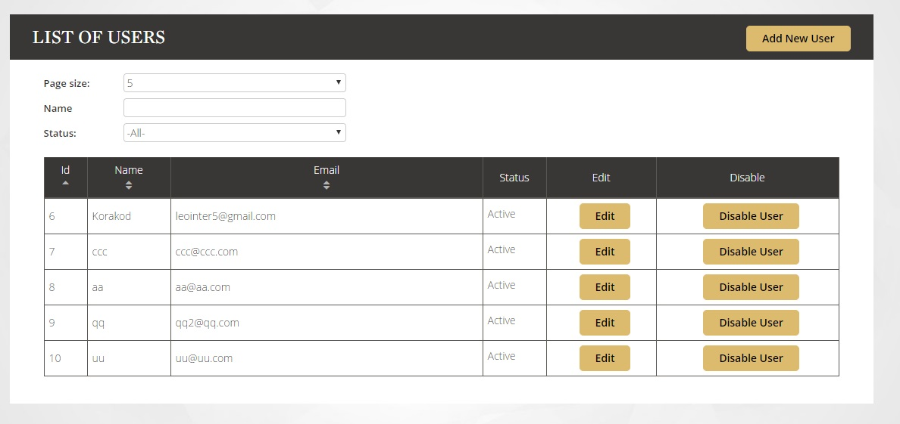

# AppLogin-2019

We want you to build a web application with the following requirements:

| User Story | Acceptance Criteria |
|:---|:---|
|As a user, I want to login to web application.|- I can put user name and password. - I can see the message when I input a username or password incorrect. - I can go to main page when a username and password is correct.|
|As a user, I want see list of user in system.|- I can search user by name or id. - I can add new or edit or delete user.|

## Also, we already prepared some stuff for you!!! :D

### 1. Base project (includes page layout)

### 2. Service API
  - You can run service api by `npm run api`
  - The endpoint to get User list is `[GET]http://localhost:3030/api/users`
  - query
    - limit: default 20 item/
    - name: search user by name
    - id: search user by id
    - example: http://localhost:3030/api/users?limit=30&name=picha&id=1
      
  #### Example
    User1 {
      name: 'User1',
      lastname: 'User',
      username: 'user',
      email: 'xxx@xx.com',
      mobile: '0800000000',
      status: true,
      province: 'bangkok'
    }
  
### 4. Interactive MockUp (as a .gif file)

### 5. Fonts (from Google Fonts)
  - `Atma:700`
  - `Gaegu`

## How we score you??!!!
  - If you can complete all the requirements above, We surely score you 100!!!! NO reason!!
    - We will give you all the feedback later ;)
  - IF YOU FEEL LIKE SOMETHING IS MISSING, WE HAVE EXTRA SCORE FOR ANY ADDITIONAL THING YOU CAN PROVIDE. (Extra can be unit test, refactoring, performance tuning, etc. REMEMBER MAXIMUM IS NOT 100!!!)

If you have any questions, please do not hesitate to ask us anytime.
Wish you luck!! :)
